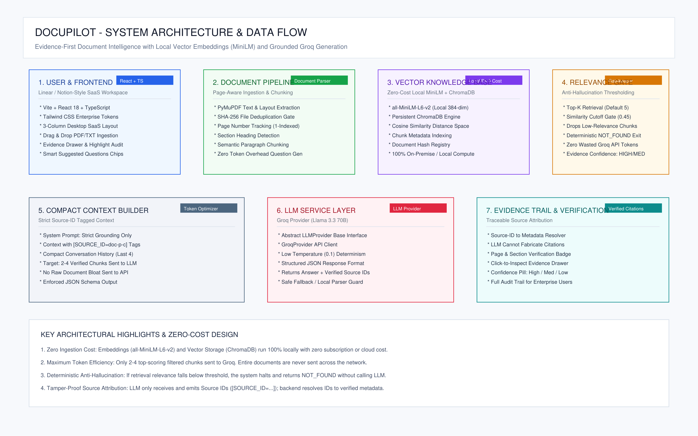

# 🚀 Vericore

<p align="center">
  <strong>Evidence-First Document Intelligence Platform for Grounded Business Q&A, Semantic Retrieval, and Source Verification.</strong>
</p>

<p align="center">
  Upload documents, ask questions in natural language, and verify every grounded answer against its source evidence.
</p>

<p align="center">
  <a href="https://github.com/Lingu17/Vericore---Evidence-First-Document-Intelligence">💻 GitHub</a> •
  <a href="https://github.com/Lingu17">GitHub Profile</a> •
  <a href="https://linkedin.com/in/lingraj-malipatil">LinkedIn</a>
</p>

<p align="center">


</p>

---

# ✨ Overview

Vericore is an **evidence-first document intelligence platform** that helps teams search, understand, and interact with business documents using Retrieval-Augmented Generation (RAG).

Users can upload PDF and TXT documents, ask questions in natural language, and receive concise answers grounded in the retrieved document content.

Unlike a basic AI chatbot, Vericore provides an **Evidence Trail** that allows users to inspect the source document, page, section, match information, and stored evidence behind a response.

When the required information cannot be sufficiently supported by the uploaded documents, Vericore returns:

> **Information not available in the uploaded documents.**

Built for:

* HR & People Operations
* Operations Teams
* Finance Teams
* Legal & Compliance
* Knowledge Management
* Document-heavy Business Workflows

---

# 📸 Product Preview

## Landing Page


---

## Document Workspace


---

## Evidence Trail


---

## Architecture



---

# 🎯 The Problem

Business information is often distributed across lengthy documents such as:

* Employee Handbooks
* Company Policies
* Benefits Documents
* Standard Operating Procedures
* Internal Agreements
* Operational Documentation
* Business Reports

Finding a specific answer manually can require searching through multiple pages and documents.

Traditional AI assistants introduce another challenge: they may generate plausible answers even when the required information is not actually present in the source documents.

Vericore addresses this with an evidence-first workflow:

```text
Upload
   ↓
Extract
   ↓
Index
   ↓
Retrieve
   ↓
Verify
   ↓
Answer
   ↓
Inspect Evidence
